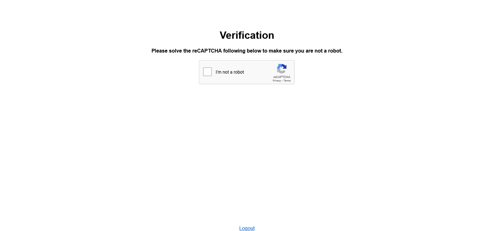

# Discord CAPTCHA Site

A powerful, advanced captcha verification system for new members in a Discord server.

## Technologies Used

- [Google reCAPTCHA v2](https://developers.google.com/recaptcha/docs/display), [hCAPTCHA](https://www.hcaptcha.com) and [Cloudflare Turnstile](https://www.cloudflare.com/products/turnstile)
- [Node.js](https://nodejs.org)
- [Express](https://expressjs.com)
- [Discord.js](https://discord.js.org)

## System Requirements

- Node.js version 16.9.0 or later (**Recommended:** Latest LTS)
- NPM version 7.0 or later (**Recommended:** Latest)
- A Discord Application with a bot account
- CAPTCHA provider API sitekey and secret.

## Docker setup

If you want to run this application without installing Node.js or other tools, you can use Docker to run it. Usage:
```
docker run \
-e VERIFIED_ROLE_ID=x \
-e CAPTCHA_PROVIDER=x \
-e REQUIRE_VERIFIED_EMAIL=x \
-e SERVER_ID=x \
-e RECAPTCHA_SECRET=x \
-e RECAPTCHA_SITEKEY=x \
-e HCAPTCHA_SITEKEY=x \
-e HCAPTCHA_SECRET=x \
-e TURNSTILE_SITEKEY=x \
-e TURNSTILE_SECRET=x \
-e CALLBACK_URL=x \
-e CLIENT_SECRET=x \
-e TOKEN=x \
ghcr.io/ckt1031/discord-captcha-site
```

## Installation

1. Clone the repository
2. Install the dependencies with `npm install` or `yarn`

## Environment Variables

- `PORT` - The port to run the server on (default: `3000`)
- `TOKEN` - The **token** of your Discord bot (Bot -> Token)
- `CLIENT_ID` - The client ID of your Discord application (Oauth2 -> General -> Client ID)
- `CLIENT_SECRET` - The client secret of your Discord application (Oauth2 -> General -> Client Secret)
- `SERVER_ID` - The ID of the Discord your server (Right click on the server -> Copy ID)
- `CALLBACK_URL` - The URL of the server `https://[your domain]/verify` (e.g. `https://example.com/verify`)
- `REQUIRE_VERIFIED_EMAIL` - Whether to require a verified email address for the user to pass the captcha (default: `false`)
- `VERIFIED_ROLE_ID` - The ID of the role to give to the user after they pass the captcha (Right click on the role -> Copy ID)

> Register new Recaptcha v2 API key [here](https://www.google.com/recaptcha/admin/create)

- `CAPTCHA_PROVIDER` - The captcha provider to use (default: `recaptcha`), available options: `recaptcha`, `hcaptcha`

> Above options are only required if you are using specified captcha provider

- `RECAPTCHA_SITEKEY` - The site key of your Google reCAPTCHA v2 API key (Settings -> reCAPTCHA keys -> Copy Site key)
- `RECAPTCHA_SECRET` - The secret key of your Google reCAPTCHA v2 API key (Settings -> reCAPTCHA keys -> Copy Secret key)
- `HCAPTCHA_SITEKEY` - The site key of your hCaptcha API key (Site -> Site key)
- `HCAPTCHA_SECRET` - The secret key of your hCaptcha API key (Settings -> Secret key)
- `TURNSTILE_SITEKEY` - The site key of your Turnstile API key (Turnstile -> Site -> Site key)
- `TURNSTILE_SECRET` - The secret key of your Turnstile API key (Turnstile -> Site -> Secret key)

## Usage

1. Start the server with `npm start` or `yarn start`
2. Add the bot to your server with `https://discord.com/api/oauth2/authorize?client_id=[CLIENT_ID]&permissions=8&scope=bot%20applications.commands`
3. In `Oauth2 -> Redirects` add the callback URL `https://[your domain]/verify` (e.g. `https://example.com/verify`)
4. Adding the bot to your server will automatically create a new role called `Verified` and a new channel called `#verify`
5. The bot will automatically send a message in the `#verify` channel with a link to the captcha verification page
6. The user will have to complete the captcha
7. After the user completes the captcha, they will be given the `Verified` role and notified in the DMs

## Production Deployment

1. Install [PM2](https://pm2.keymetrics.io) with `npm install pm2 -g` or `yarn global add pm2`
2. Start the server with `pm2 start ecosystem.config.js`
3. Run command `pm2 start --max-memory-restart 300M --attach npm -- run start`
4. (Optional) Run command `pm2 startup` to enable startup on boot

# Screenshots

## Captcha Verification Page


